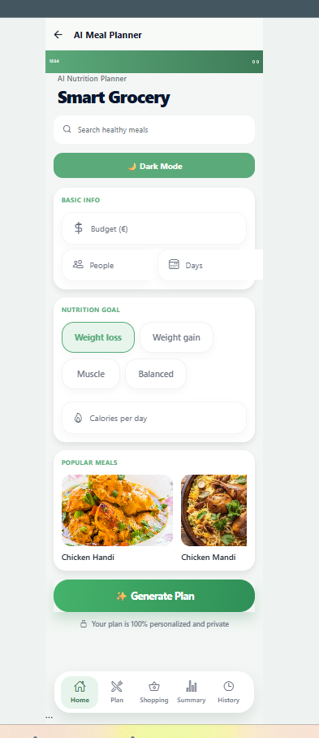
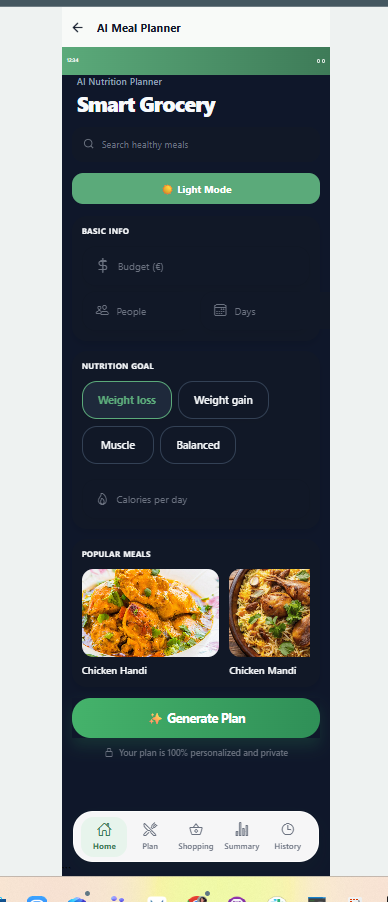
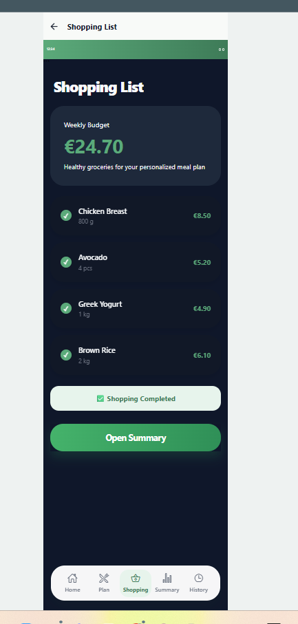
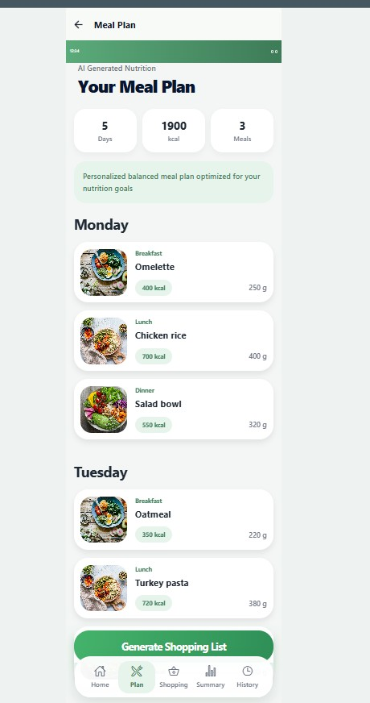
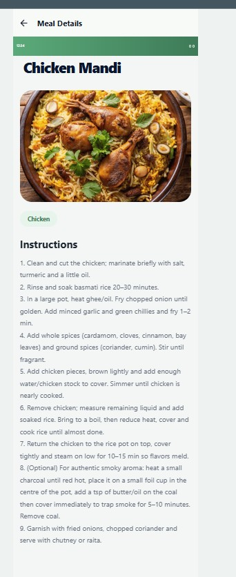

# AI Meal Planner

A premium React Native meal planning application with API integration, Context API theme management, Redux Toolkit shopping state, AI-inspired meal generation flow, shopping planning, and nutrition tracking.

## Features

* AI-inspired meal generation flow
* Dynamic meal planner UI
* Global Dark / Light Mode
* Context API Theme Management
* Redux Toolkit Shopping State
* useSelector and useDispatch
* API integration with TheMealDB
* Meal details screen
* Horizontal FlatList rendering
* Loading state handling
* Error handling
* React Navigation integration
* Reusable component architecture
* Persistent meal history
* Shopping list screen
* Responsive premium mobile UI

## Technologies

* React Native
* Expo
* React Navigation
* Context API
* Redux Toolkit
* React Redux
* AsyncStorage
* FlatList
* JavaScript
* TheMealDB API

## API

The project uses:

https://www.themealdb.com/api.php

## Screens

### Home Screen

* User nutrition preferences
* Calories and days input
* API meal recommendations
* Search and goals UI
* Dynamic dark/light mode

### Meal Plan Screen

* Daily meal planning
* Nutrition overview
* Calories and meals metrics
* Premium card-based layout

### Meal Details Screen

* Meal image
* Category
* Instructions
* API-driven details page

### Shopping Screen

* Interactive shopping checklist
* Redux global state management
* Dynamic checkbox updates

### History Screen

* Saved meal plans

## Redux Functionality

The shopping screen uses Redux Toolkit for global state management.

Implemented:

* createSlice
* configureStore
* Provider
* useSelector
* useDispatch

Users can:

* toggle shopping items
* manage global shopping state
* dynamically update shopping UI

## Context API Functionality

The application uses Context API for global theme management.

Implemented:

* ThemeContext
* ThemeProvider
* useContext
* Dynamic dark/light mode
* Global UI theme switching

## Installation

```bash
npm install
```

## Run Project

```bash
npm start
```

or

```bash
npx expo start
```

## Project Structure

```bash
src/
 ├── api/
 ├── assets/
 ├── components/
 ├── constants/
 ├── context/
 ├── redux/
 ├── data/
 ├── navigation/
 ├── screens/
 └── utils/
```

## Screenshots

### Light Mode



### Dark Mode



### Shopping Redux Screen



### Meal Plan



### Meal Details



## GitHub Repository

https://github.com/yulianakosenko/Kostenko_cross_assignment_6

## Author

Yuliya Kostenko
