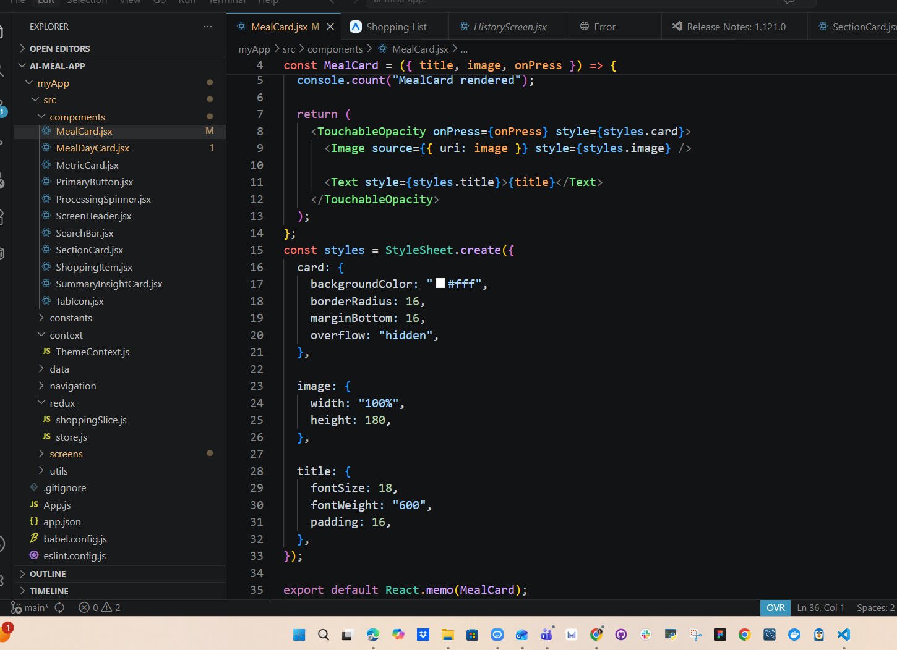
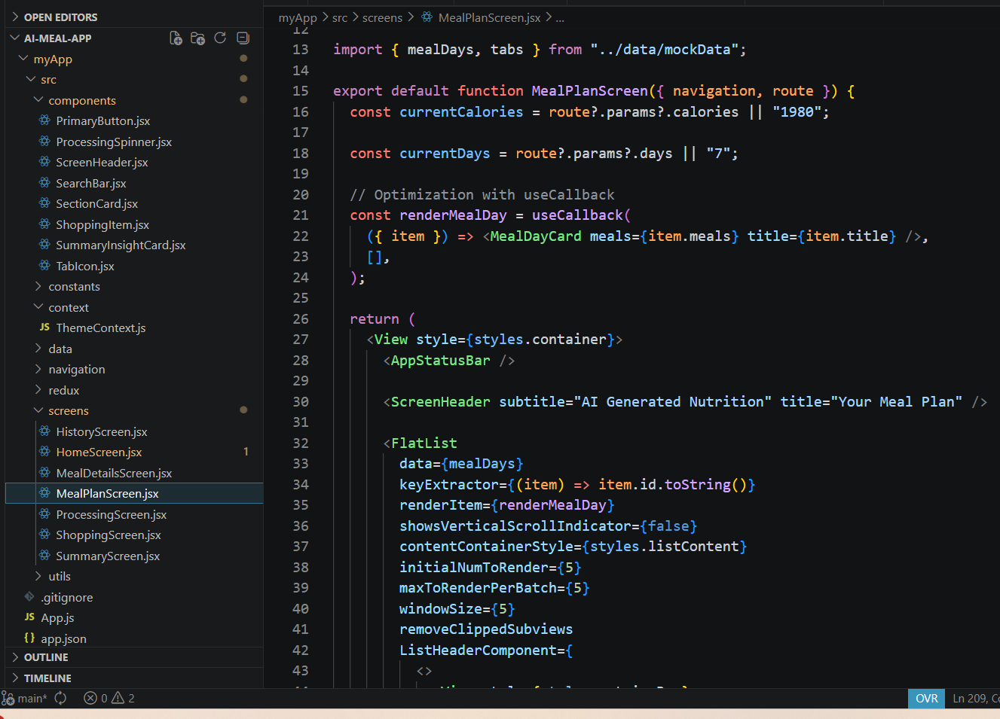
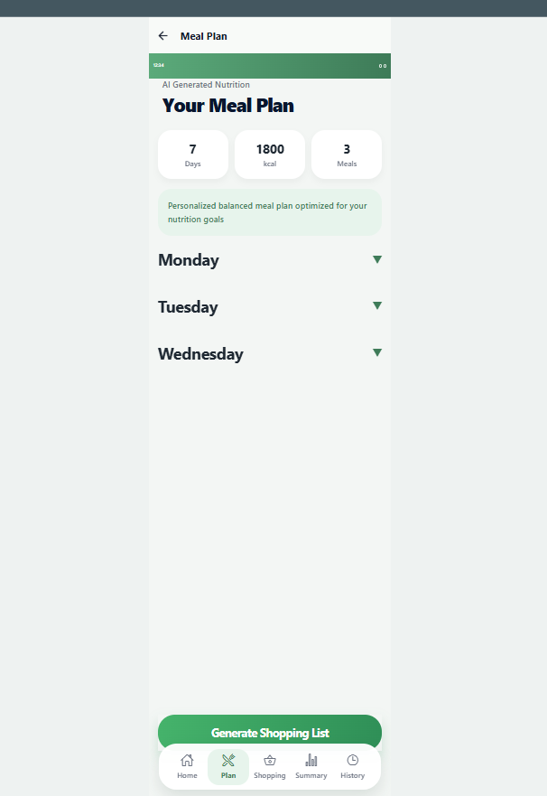
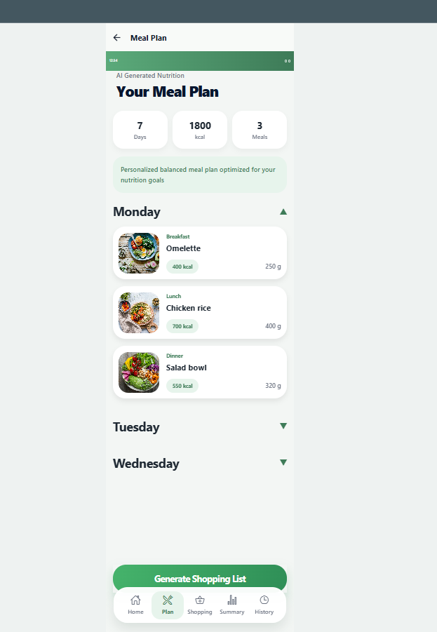

````md
# AI Meal Planner

A premium React Native meal planning application with AI-inspired meal generation, performance optimization, Context API theme management, Redux Toolkit shopping state, shopping planning, and nutrition tracking.

---

## Features

* AI-inspired meal generation flow
* Dynamic meal planner UI
* Global Dark / Light Mode
* Context API Theme Management
* Redux Toolkit Shopping State
* useSelector and useDispatch
* API integration with TheMealDB
* OpenAI backend integration
* Meal details screen
* Horizontal FlatList rendering
* Loading state handling
* Error handling
* React Navigation integration
* Reusable component architecture
* Persistent meal history
* Shopping list screen
* Responsive premium mobile UI
* Expandable animated meal cards
* FlatList performance optimization

---

## Technologies

* React Native
* Expo
* React Navigation
* Context API
* Redux Toolkit
* React Redux
* AsyncStorage
* FlatList
* LayoutAnimation
* JavaScript
* Node.js
* Express.js
* OpenAI API
* TheMealDB API

---

## API

The project uses:

### TheMealDB API

https://www.themealdb.com/api.php

### OpenAI API

Used for AI meal generation backend architecture.

---

## Screens

### Home Screen

* User nutrition preferences
* Calories and days input
* API meal recommendations
* Search and goals UI
* Dynamic dark/light mode

### Meal Plan Screen

* Daily meal planning
* Nutrition overview
* Calories and meals metrics
* Premium card-based layout
* Expandable animated meal cards

### Meal Details Screen

* Meal image
* Category
* Instructions
* API-driven details page

### Shopping Screen

* Interactive shopping checklist
* Redux global state management
* Dynamic checkbox updates

### History Screen

* Saved meal plans
* AsyncStorage persistence

### Processing Screen

* AI meal generation loading animation
* Animated loading indicators
* Backend AI integration

---

## Redux Functionality

The shopping screen uses Redux Toolkit for global state management.

Implemented:

* createSlice
* configureStore
* Provider
* useSelector
* useDispatch

Users can:

* toggle shopping items
* manage global shopping state
* dynamically update shopping UI

---

## Context API Functionality

The application uses Context API for global theme management.

Implemented:

* ThemeContext
* ThemeProvider
* useContext
* Dynamic dark/light mode
* Global UI theme switching

---

## Performance Optimization

### Animation

Implemented smooth UI animations using LayoutAnimation.

Features:

* Expandable and collapsible MealDayCard
* Smooth interaction transitions
* Interactive animated meal cards

### Render Optimization

Optimized rendering performance using:

* React.memo
* useCallback
* FlatList optimization techniques

Implemented:

* Reduced unnecessary rerenders
* Stable renderItem callbacks
* Improved rendering stability
* Better UI responsiveness

### FlatList Optimization

Implemented:

* initialNumToRender
* maxToRenderPerBatch
* windowSize
* removeClippedSubviews

### Bundle / Dependency Optimization

* Avoided heavy unnecessary dependencies
* Used lightweight React Native optimization techniques
* Improved overall application performance

### AI Backend Architecture

Implemented:

* OpenAI API backend integration
* Frontend-backend communication
* AI meal generation structure
* Loading state management
* Error handling architecture

---

## Optimization Results

* Improved rendering performance
* Reduced unnecessary component updates
* Added smoother UI interactions
* Optimized list rendering
* Improved user experience
* Enhanced app responsiveness

---

## Installation

```bash
npm install
```

---

## Run Project

### Frontend

```bash
npx expo start
```

### Backend

```bash
cd backend
npm install
npm start
```

---

## Project Structure

```bash
src/
 ├── api/
 ├── assets/
 ├── components/
 ├── constants/
 ├── context/
 ├── redux/
 ├── data/
 ├── navigation/
 ├── screens/
 └── utils/

backend/
 ├── server.js
 ├── package.json
 └── .env
```

---

## Screenshots

### Light Mode


### Dark Mode


### Shopping Redux Screen


### Meal Plan


### Meal Details


---

## Optimization Screenshots

### React.memo Optimization



### FlatList Optimization



### Animation Closed



### Animation Opened



---

## GitHub Repository

:contentReference[oaicite:0]{index=0}

---

## Author

Yuliya Kostenko
````
